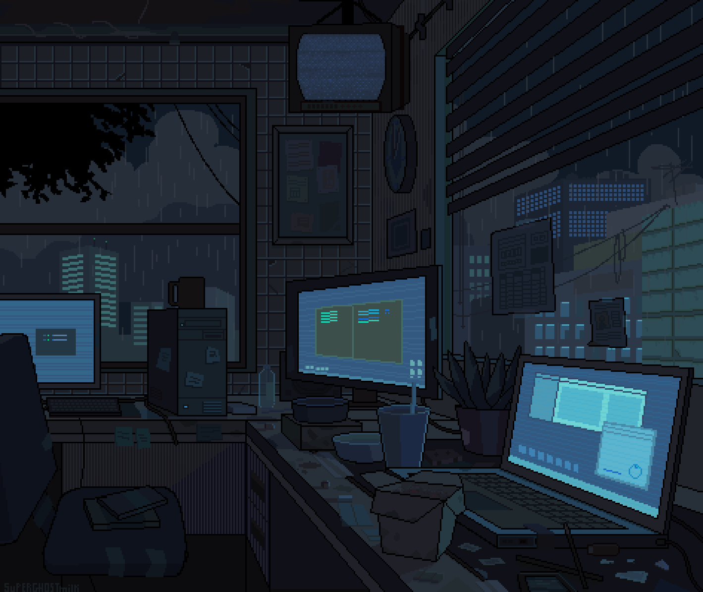

  

<h1 align="center">Hi, I'm Aalaya 👋</h1>

<h3 align="center">
.NET Developer | C# | ASP.NET Core | Web API | SQL | Cloud
</h3>

  <a href="https://www.linkedin.com/in/aalaya-k">LinkedIn</a> •
  <a href="mailto:aparthiaalaya15@gmail.comL">Email</a>

---

## 👩‍💻 About Me

- .NET Developer focused on **building scalable backend systems**
- Experienced with **C#, ASP.NET Core, Entity Framework Core**
- Interested in **Cloud Engineering and Microservices**
- Passionate about learning modern software architecture

---

## 🚀 Currently Learning

- Advanced **ASP.NET Core**
- **Microservices Architecture**
- **Docker & Cloud Deployment**
- **System Design for scalable applications**

---

## 🧰 Tech Stack

---

## 📈 GitHub Stats

---

## 🔥 GitHub Streak

---

## 🐍 Contribution Snake

  <picture>
    <source media="(prefers-color-scheme: dark)" srcset="https://raw.githubusercontent.com/Aalaya1572/Aalaya1572/output/github-snake-dark.svg" />
    <source media="(prefers-color-scheme: light)" srcset="https://raw.githubusercontent.com/Aalaya1572/Aalaya1572/output/github-snake.svg" />
    
  </picture>

---

## 🌱 Future Work

Soon I will be adding projects related to:

- ASP.NET Core Web APIs
- Full Stack .NET Applications
- Cloud-based scalable systems
- Microservices architecture

---

Thanks for visiting my GitHub profile!

